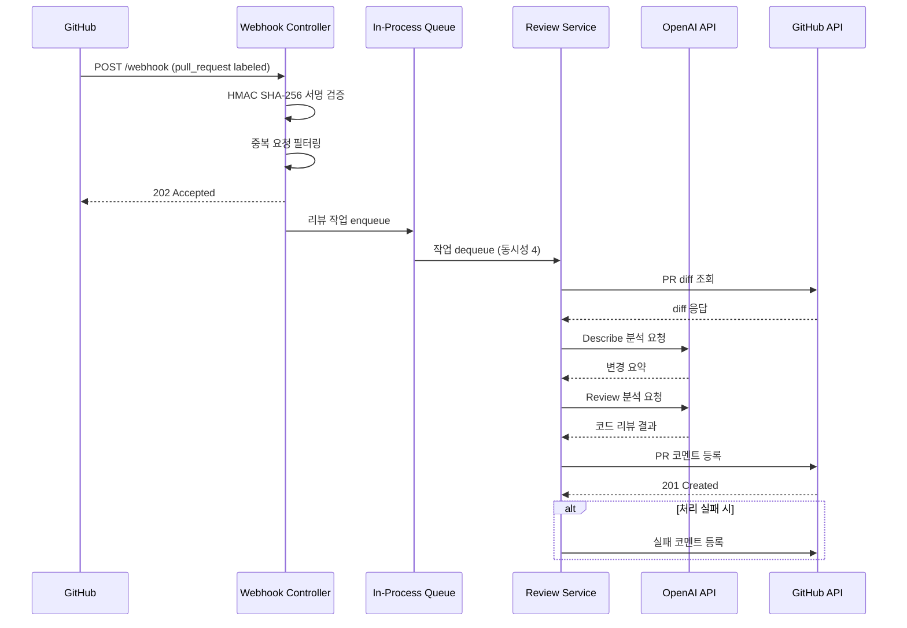

# 🤖 Review Server

> GitHub PR에 `AI-REVIEW` 라벨을 붙이면, AI가 자동으로 코드 리뷰를 수행하고 결과를 PR 코멘트로 남기는 비동기 리뷰 서버

## 프로젝트 소개

Review Server는 코드 리뷰 병목을 줄이기 위해 만든 자동화 도구입니다. GitHub Webhook을 수신하면 HMAC 서명 검증과 중복 요청 필터링을 거친 뒤, 인프로세스 큐에서 비동기로 리뷰를 처리합니다. 외부 API 호출에 의한 지연이 Webhook 응답에 영향을 주지 않도록, 요청 수신과 리뷰 처리를 완전히 분리하는 구조로 설계했습니다.

## 기술 스택

| 영역 | 기술 |
|---|---|
| Language | Java 17 |
| Framework | Spring Boot 3, Spring WebFlux |
| HTTP Client | WebClient (Non-blocking) |
| AI | OpenAI GPT API |
| External API | GitHub REST API v3 |
| Build | Gradle |
| Architecture | Hexagonal (Ports & Adapters) |

## 아키텍처

### 설계 원칙

- **Hexagonal Architecture** — 외부 의존성(GitHub, OpenAI)을 어댑터로 격리하여 비즈니스 로직의 테스트 용이성과 교체 가능성을 확보했습니다.
- **비동기 파이프라인** — Webhook 수신 즉시 202 Accepted를 반환하고, 실제 리뷰는 인프로세스 큐(용량 256, 동시성 4)에서 처리합니다. GitHub의 10초 Webhook 타임아웃 제약을 우회하면서도, 별도 메시지 브로커 없이 단일 프로세스에서 안정적으로 동작합니다.
- **Fail-safe 처리** — 리뷰 도중 오류가 발생하면 PR에 실패 코멘트를 남겨, 사용자가 상태를 인지할 수 있도록 했습니다.

### 프로젝트 구조

```
src/main/java/reviewbot/review_server/
├── adapter/in/        # 입력 어댑터 — Webhook Controller, HMAC 검증
├── common/            # 공통 설정, WebClient 빈 구성
├── dto/               # 요청/응답 DTO, Enum 정의
├── port/in/           # 입력 포트 — UseCase 인터페이스
└── service/           # 비즈니스 로직 — 큐 관리, 리뷰 파이프라인
```

## 처리 흐름



## 주요 동작 조건

- **이벤트**: `pull_request` + `action=labeled`
- **라벨**: `AI-REVIEW` 라벨이 붙은 경우에만 처리
- **서명 검증**: `X-Hub-Signature-256` 헤더를 통한 HMAC SHA-256 검증 필수

## 실행 방법

```bash
# 환경 변수 설정
export OPEN_AI_API_KEY=<your-openai-key>
export GITHUB_TOKEN=<your-github-token>
export WEB_HOOK_SECRET=<your-webhook-secret>

# 로컬 실행
./gradlew bootRun --args='--spring.profiles.active=local'
```

## 설정 예시 (application.yml)

```yaml
client:
  open-ai:
    base-url: https://api.openai.com/v1
    model: gpt-5-mini
    max-token: 15000
    api-key: ${OPEN_AI_API_KEY}
  github:
    base-url: https://api.github.com
    data-type: application/vnd.github+json
    version: X-GitHub-Api-Version
    version-date: 2022-11-28
    token: ${GITHUB_TOKEN}
    web-hook-secret: ${WEB_HOOK_SECRET}
  prompt:
    common: ...
    review: ...
    describe: ...
```

## Git 컨벤션

Google 스타일 기반의 커밋 메시지 규칙을 따릅니다.

```
feat: add review failure comment

Prevent silent failures by posting a comment
when the review pipeline encounters an error.
Issue: #42
```

| 타입 | 용도 | 예시 |
|---|---|---|
| `feat` | 사용자 가치가 추가되는 기능 | `feat: add review failure comment` |
| `fix` | 버그 수정 | `fix: handle missing signature header` |
| `refactor` | 기능 변화 없는 구조 개선 | `refactor: split github service flow` |
| `docs` | 문서 변경 | `docs: update readme` |
| `test` | 테스트 추가/수정 | `test: add webhook controller test` |
| `chore` | 빌드/설정/의존성 | `chore: bump spring boot` |